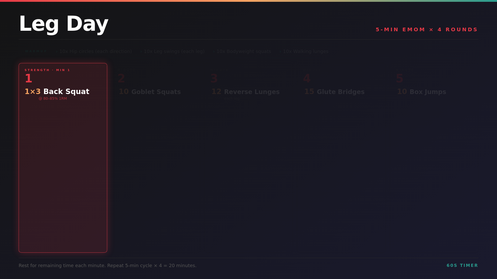

# workouts-to-plex

Converts workout plan images into Plex-compatible videos with a countdown timer overlay.

Drop a static image (or define workouts in `workouts.yaml`) and the app generates a looping MP4 with a configurable countdown timer in the corner — perfect for EMOM, AMRAP, or any timed workout format.



The app cycles through each exercise, highlighting one at a time every 60 seconds so you always know what's up next. If a warmup is defined, it is highlighted first — then the rotation continues through the workout exercises only for the remainder of the video.

## How it works

```
workouts.yaml → HTML template → Chromium screenshot → PNG → FFmpeg → MP4 (Plex)
```

1. On startup, reads `workouts.yaml` and renders each workout as a styled HTML card
2. Chromium (headless) screenshots each card at the configured resolution (default 1920×1080)
3. FFmpeg wraps the PNG into an MP4 with a countdown timer overlaid in the bottom-right corner
4. Output MP4s land in the output directory, ready for Plex to index
5. The app then watches the input directory for any manually dropped images and converts those too

## Volumes

| Path | Purpose |
|------|---------|
| `/workouts.yaml` | Workout definitions (see below) |
| `/input` | Intermediate PNGs — auto-generated, or drop your own images here |
| `/output` | Plex media library — point your Plex library at this directory |

## Quick start

```bash
git clone https://github.com/jheck90/workouts-to-plex
cd workouts-to-plex
mkdir images plex
docker compose up --build
```

Your Plex library should point at `./plex/`.

## Configuration

Edit `workouts.yaml` to define your workouts:

```yaml
settings:
  width: 1920   # output resolution width
  height: 1080  # output resolution height

workouts:
  - name: "20 Min EMOM"
    subtitle: "Every Minute On the Minute"
    timer_seconds: 60
    theme: dark
    rounds:
      - minute: 1
        exercises:
          - movement: "Burpees"
            reps: 10
      - minute: 2
        exercises:
          - movement: "Air Squats"
            reps: 15
    notes: "Rest for remaining time each minute. Repeat for 20 minutes."
```

Re-run the container after editing `workouts.yaml` to regenerate the videos. Existing outputs are skipped unless you delete the corresponding MP4.

## Environment variables

| Variable | Default | Description |
|----------|---------|-------------|
| `CONFIG_PATH` | `/workouts.yaml` | Path to workout definitions file |
| `INPUT_DIR` | `/input` | Directory to watch for new images |
| `OUTPUT_DIR` | `/output` | Directory to write MP4s into |
| `TIMER_SECONDS` | `60` | Default countdown duration (overridden per-workout in yaml) |
