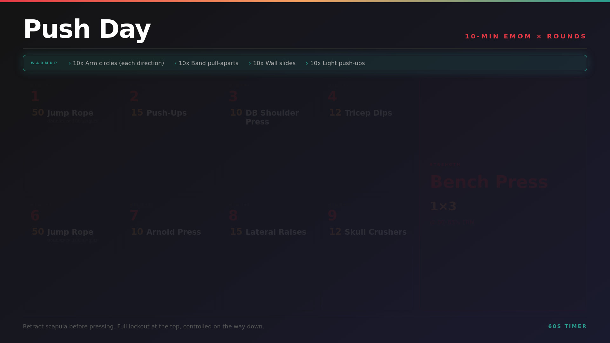

# workouts-to-plex

Converts workout plan images into Plex-compatible videos with a countdown timer overlay.

Drop a static image (or define workouts in `workouts.yaml`) and the app generates a looping MP4 with a configurable countdown timer in the corner — perfect for EMOM, AMRAP, or any timed workout format.



The app cycles through each exercise, highlighting one at a time every 60 seconds so you always know what's up next. If a warmup is defined, it is highlighted first — then the rotation continues through the workout exercises only for the remainder of the video.

## How it works

```
workouts.yaml → HTML template → Chromium screenshot → PNG → FFmpeg → MP4 (Plex)
```

1. On startup, reads `workouts.yaml` and renders each workout as a styled HTML card
2. Chromium (headless) screenshots each card at the configured resolution (default 1920×1080)
3. FFmpeg wraps the PNG into an MP4 with a countdown timer overlaid in the bottom-right corner
4. Output MP4s land in the output directory, ready for Plex to index
5. The app then watches the input directory for any manually dropped images and converts those too

## Volumes

| Path | Purpose |
|------|---------|
| `/workouts.yaml` | Workout definitions (see below) |
| `/input` | Intermediate PNGs — auto-generated, or drop your own images here |
| `/output` | Plex media library — point your Plex library at this directory |

## Quick start

```bash
git clone https://github.com/jheck90/workouts-to-plex
cd workouts-to-plex
mkdir images plex
docker compose up --build
```

Your Plex library should point at `./plex/`.

## Configuration

Edit `workouts.yaml` to define your workouts:

```yaml
settings:
  width: 1920   # output resolution width
  height: 1080  # output resolution height

workouts:
  - name: "20 Min EMOM"
    subtitle: "Every Minute On the Minute"
    timer_seconds: 60
    theme: dark
    rounds:
      - minute: 1
        exercises:
          - movement: "Burpees"
            reps: 10
      - minute: 2
        exercises:
          - movement: "Air Squats"
            reps: 15
    notes: "Rest for remaining time each minute. Repeat for 20 minutes."
```

Re-run the container after editing `workouts.yaml` to regenerate the videos. Existing outputs are skipped unless you delete the corresponding MP4.

## Environment variables

| Variable | Default | Description |
|----------|---------|-------------|
| `CONFIG_PATH` | `/workouts.yaml` | Path to workout definitions file |
| `INPUT_DIR` | `/input` | Directory to watch for new images |
| `OUTPUT_DIR` | `/output` | Directory to write MP4s into |

## Roadmap / TODO

- **Cleanup intermediate files** — temp `.mp4` cycle files and intermediate frame PNGs are left on disk after conversion. Add a cleanup pass to remove them once the final output MP4 is written.

- **Batch job mode** — the app currently runs as a long-lived service (watching `/input` for new files) even though the actual work is a one-shot generation step. Convert to a batch/run-once mode so it exits cleanly after processing and doesn't hold resources. A sidecar watcher or a simple cron trigger could handle the "new file" case separately.

- **AI workout generation via remote trigger** — add a Claude-backed prompt wrapper so users can describe a workout in plain English (e.g. "give me a 5-min upper body EMOM") and have it generate the `workouts.yaml` entry, trigger the job, and produce the video. Could be exposed as a Claude remote trigger endpoint, a small HTTP API, or a CLI flag.

- **Discord integration** — notify a Discord channel when new media is ready in Plex, and/or accept slash commands from Discord to trigger workout generation (feeding into the AI wrapper above). Closes the loop: ask for a workout in Discord → Claude generates it → job runs → Discord confirms it's in Plex.

- **Configurable Plex naming convention** — the output filename format (`s<year>e<episode> - <Name>.mp4`) and category subdirectory are hardcoded. Expose these as env vars so users can match whatever naming scheme their Plex library expects without rebuilding the container.

- **Per-workout timer duration on the video** — the countdown timer is currently hardcoded to 60 seconds in the FFmpeg filter regardless of the workout's `timer_seconds` value. The overlay should read from the per-workout YAML field so non-60s workouts (e.g. 30s AMRAP, 90s strength intervals) display the correct countdown.

- **Per-round counter** - The videos are intentionally longer than necessary. Add a counter that lets the user know how many loops have passed.

- **Cleanup Logging** - Add various verbosity